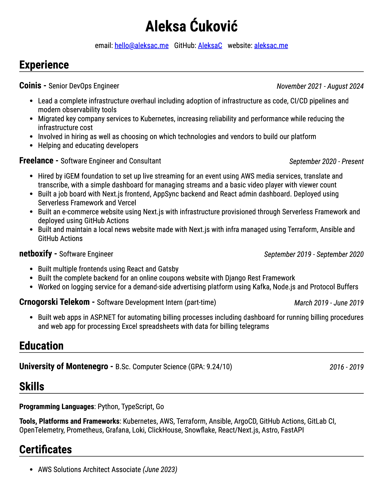

# Resume

This repository contains the latest version of my resume.

I write the content in markdown, style the document with CSS and use Chrome to
print to PDF the HTML generated using [pandoc](https://github.com/jgm/pandoc).

## Motivation

While this may seem like an elaborate setup, it's really not that complicated.
In fact, one of the main motivations for this setup was to simplify the [previous version](https://github.com/AleksaC/old-resume)
that was written in LaTeX.

Since I don't really use LaTeX, I kept forgetting everything but the basics and had
to look things up constantly as I was trying to make changes.

I opted for markdown because it was simple and I write it relatively often.

The problem with markdown is that it's hard to get it to be compact and look
decent without adding some complexity.

## Making changes

Even though this has been built primarily to fit my needs, and I haven't planned
on making it into a template, I think it can still be used as one.

Small changes can be made through GitHub web app. When you open a pull request,
a GitHub action generates PDF and PNG previews and uploads them as artifacts.

For bigger changes, where you need a tighter feedback loop, you can clone the repo
and use the [`live_compile.py`](live_compile.py) script to get the updated preview
after changing the relevant files.

When working locally, you may need to provide a `CHROME` variable, which represents
the command used for running the browser to generate the PDF. It defaults to
`chrome`, which is what I use on my machine.

## FAQ

### Why not just use Google Docs?

I don't use Google Docs, so it wouldn't have saved any time, the end result would
probably look worse, and I wouldn't enjoy the process of making the resume.

### Why use an entire browser to generate a pdf document?

I tried using `wkhtmltopdf` which initially seemed like the default tool for the
job. Later, I found out it was unmaintained and soon started facing difficulties
as my design was getting more complicated.

I wasn't happy with the alternatives either and was ready to give up on the whole
idea when I remembered that Chrome has a print option, which seemed to give a
decent output.

The pdf outputs that Chrome generates are great and are generated reasonably fast.
In addition to that, Chrome is available on every machine I use, so it's not like
I'll be installing it only for this purpose.

## Preview

## Contact
- [Personal website](https://aleksac.me)
- 
- hello@aleksac.me
